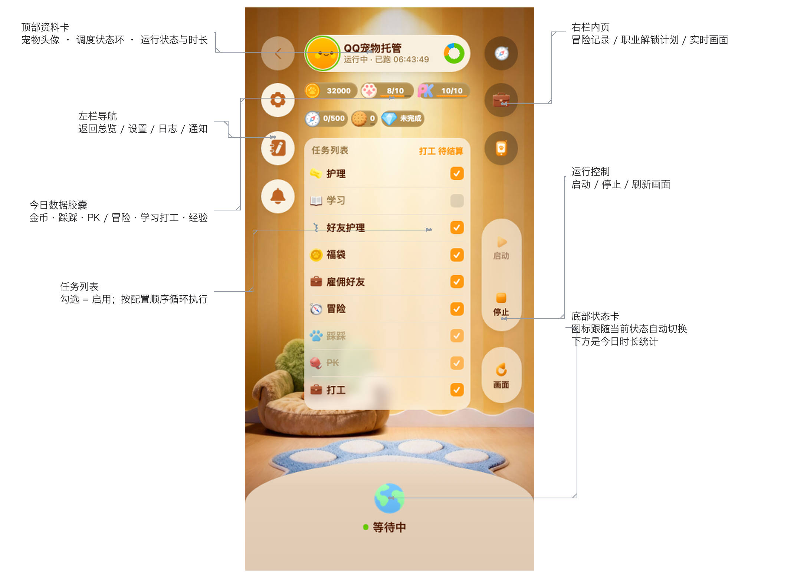

# QQ 宠物自动化助手 · macOS 适配版

> 本仓库是 [490720818/qq-pet-copilot](https://github.com/490720818/qq-pet-copilot)（GPL-3.0）
> 的 **macOS 本地适配版**。上游面向 Windows（PyQt6 GUI + scrcpy 嵌入 + 模拟器注入链路），
> 本适配版的目标运行方式是 **macOS + Android 真机**：**控制台调度器 + 手机浏览器仪表盘**，
> 不使用 Windows GUI 与模拟器注入链路。差异清单与上游同步方式见 [MAC-PORT.md](MAC-PORT.md)。

基于 uiautomator2 控件定位 + RapidOCR 文字识别的 QQ 宠物自动托管工具（分辨率无关）。
任务队列自动调度，按金币和**学习/工作时长**规则推进，并自动处理**被雇佣召回**、
**体力/清洁照顾**、**好友护理/雇佣**等日常。

**本适配版相对上游的主要改动**：

- **手机仪表盘**（`dashboard.py`，纯标准库零依赖）：手机浏览器打开即用的移动端界面，
  画面/日志/统计/任务开关/设置编辑一屏搞定；官方首页图标 1:1 复刻（胶囊行、圆钮、
  PWA 主屏图标），底部状态卡按当前状态换图标。
- **回主页兼容修复**（新版 QQ 9.3.6x）：打工/学习面板返回主页时 3D 主页需 1~2 秒重渲染，
  原逻辑会连环按 back 把宠物模块整个退回系统桌面；现改为每次 back 后先等渲染再检查，
  连续失败改用官方 scheme 重开宠物页兜底。
- macOS 环境适配：adb 路径探测（Homebrew / Android SDK）、`winreg` 导入降级、
  失败告警改用 osascript 桌面通知。

> **游戏机制注意：护理相关勋章如果要拿的话不能一键！！！**
> 一键护理不计入勋章进度，要拿勋章必须把护理方式配成"ocr检测"手动喂食/洗澡
> （配置项 `care.method` / `friend_care.method`）。

推荐使用调度任务中设置时间段来规划每天的任务。推荐配置：

| 玩家类型 | 推荐配置 |
| --- | --- |
| 战力玩家 | 每天学习 19 小时左右，剩下 5 小时优先完成 600 次冒险（设置跳过天色；有条件的话用一个小号给大号一直护理），还有剩余可以小号雇佣大号 |
| 均衡玩家 | 每天学习 15 小时，5 小时冒险 600 次（设置跳过天色），4 小时被小号雇佣 |
| 职业玩家 | 优先打工拿工分升级职业，职业升级卡住了再去学习 |
| 勋章玩家 | 无推荐配置，按勋章要求来即可 |

## 功能

- **任务队列调度（默认 `task_queue`）**：按 `tasks.order` 顺序扫描执行，每个任务独立
  enabled / trigger（interval 间隔 / daily 每日时间点窗口）/ 执行时间窗 / 成功失败退避
  （失败退避统一由设置页"任务失败重试间隔"`tasks.failure_interval` 控制）；
  冒险/学习/打工/雇佣好友互斥，作为主任务组统一调度且**非阻塞延时收尾**（进行中 OCR 剩余
  时间登记 pending，到点自动收尾计数，期间先跑其他任务）；踩踩/PK/好友护理/被雇佣检查按各自
  定时与次数排期，失败自动延后重试。另有旧 `legacy` 引擎（顺序写死）可切换。
- **学习场景**：出门 → 学校 → OCR 识别学园阶段（初级/中级/高级/进修，选课顺序自动适配）→
  归位选课（力量/智力/魅力）→ 上课 → 下课计数；毕业自动切下一阶段课程。
  每节按学园累计学习时长：初级 10 / 中级 20 / 高级 30 / 进修 45 分钟。
- **打工场景**：出门 → 小镇 → OCR 识别打工地点进入（设置页下拉可选 8 个地点）→
  按 `work.duration` 选时长（10分钟/45分钟/2小时）→ 顺带雇佣好友 → 开工。
  每次按所选时长累计打工时长。
- **学习工作时长上限**：学习/打工时长按学园与所选时长结算累计，
  累计 >= `schedule.daily_hour_limit`（小时，0=不限）后**今天不再学习只打工**；
  首次运行新版本时，老进度只有次数会按旧版点数系数自动换算成时长（只迁移一次）。
- **冒险场景**：每天到达配置时间后优先冒险，连跑 `adventure.batch` 次；
  可开启"天色不对"自动召回（点完"确认召回"会验证生效，召回后直接回出门页连跑）。
- **被雇佣检查/召回**：按时间段定时出门检测被雇佣中，按配置"等到 25/75"或"立刻召回"处理，
  召回自动计数后回主页面；被雇佣期间主任务不触发。
- **好友护理 / 雇佣好友**：按时间段 + 调度间隔巡检指定好友家（ocr检测/一键护理）；
  雇佣好友会检测雇佣 CD、出门前预检进行中活动，主动延后不误点。
- **踩踩 / PK**：好友互动按各自 `start_time` 与每天次数调度；踩踩自动跳过已踩过的好友，
  PK 每个好友可打 3 次、打完自动切换下一个好友。
- **状态照顾**：任务前读取体力/清洁/心情，按阈值自动喂食、洗澡（持续按压搓洗，
  搓洗按回合复测、连续不提升自动抬手重按自愈，达到上限仍不达标则跳过本次洗澡）；支持一键护理。
- **控制方案**（设置页下拉）：`injectInputEvent`（默认，真机推荐，uiautomator2 事件注入）/
  `minitouch`（模拟器推荐，openstf minitouch socket 直发，更快更稳）；minitouch 因
  非 Root/SELinux 不可用时会自动回退 injectInputEvent 并写回配置。
- **异常自动恢复**：页面错乱先回主页面重进场景自愈，仍失败走"重启设备/重启游戏"
  （模拟器多实例自动探测分步停/启）→ 重开 QQ → 回宠物页；模拟器模式用
  内置 opener **零注入**打开宠物主页（MuMu 机型伪装 / 门禁 MMKV 补丁 + 官方 scheme 直开，
  frida 仅作一次性兜底、不常驻注入，旧版常驻注入会被 QQ 风控"使用外挂插件"）；
  模拟器重启后 adb 抖动会先等回线，不再误判整机重启；多开实例互不干扰。
- **失败告警通知**：主任务多次重试仍失败时发 macOS 桌面通知（osascript）+ OnePush
  多渠道推送（Bark / PushPlus / Server酱 / SMTP / 自定义 webhook），并附当前手机截图。
- **每日计数与时长持久化**：各场景次数与累计时长按天记录在 `runs/*.json`（含历史），
  中途停止重跑接着计数，跨天自动归档清零（单账号，不按账号拆分）。
- **手机仪表盘（本适配版新增，`dashboard.py`）**：纯标准库零依赖的移动端界面，
  手机浏览器打开即用——实时画面/日志/统计/任务开关/设置编辑，官方首页视觉 1:1 复刻
  （胶囊行、右栏圆钮、PWA 主屏图标）；**底部状态卡按当前状态换图标**
  （学习=书本+铅笔、打工=爪印金币+绿箭头、冒险=指南针、护理=橙色 SOAP、踩踩=爪印、
  PK=PK 字样、等待中=地球，全部取自官方素材）。状态由调度器日志 + 队列文件推断。
- **GUI（PyQt6-Fluent-Widgets，上游 Windows 版功能）**：左侧 Fluent 导航（主页/调度/统计/任务/设置），
  顶部全局工具栏常驻（开始/停止/画面镜像/连接测试/手动重启 + 运行时间，画面镜像开关状态持久化
  `gui.mirror`）；主页 = scrcpy 实时画面（9:16 竖屏等比自适应嵌入）+ 宠物状态/任务队列/
  今日统计/日志卡片——任务队列卡调度器未运行时也按配置推算下一任务，今日统计以
  学习(h)/工作(h) 时长 + 各任务当日次数的两行网格展示；统计页为各任务近 N 天次数的
  平滑折线图；主题支持 跟随系统/深色/浅色（`gui.theme`，即时切换）；
  调度/任务/设置页可视化修改 config.yaml，保存后**热加载即时生效**（无需重启）；
  "手动重启"按配置执行一次异常恢复，恢复后自动重启调度器；
  设置页"检查更新"：启动后自动检查一次、之后每 6 小时一次，发现新版本显示 Release 下载链接。
  （本适配版不维护 `main.py`：它依赖 win32 + scrcpy 窗口嵌入，macOS 下不适用。）
- **分辨率无关定位**：优先 u2 控件选择器，游戏内自绘按钮用 RapidOCR（PP-OCRv6 tiny）
  整屏文字识别，换分辨率/机型无需改代码。

## 快速开始（macOS）

需要 **Python 3.13** 与 **Android 真机**（USB 调试打开、QQ 已登录且 ≥ 9.3.25、
充电时不熄屏：`adb shell settings put global stay_on_while_plugged_in 7`）。

```bash
python3 -m venv .venv
.venv/bin/pip install -r requirements.txt

# 1) 配置：复制模板后编辑（config.yaml 不入库）
cp config.example.yaml config.yaml
#   adb.path          = /opt/homebrew/bin/adb   （留空自动探测）
#   adb.device_serial = 你的设备序列号            （adb devices 查看）
#   recover.method    = 重启游戏                  （真机若设了锁屏密码，别用"重启设备"）

# 2) 确认设备在线
adb devices

# 3) 启动
./run.sh          # = .venv/bin/python scenarios/runner.py，控制台调度器（Ctrl+C 停止）
./dashboard.sh    # 手机仪表盘，默认端口 8787，内网 http://<Mac 的局域网 IP>:8787
```

### 手机仪表盘（`./dashboard.sh`）

纯标准库、零依赖，手机浏览器打开即用：

- 默认端口 8787、绑定 `0.0.0.0`，内网 `http://<Mac 局域网 IP>:8787`；
- 日志 3s、数据 6s 自动刷新；可实时改配置、开关任务、看画面/统计/日志；
- **后台常驻**：脚本用 `start_new_session` 脱离终端启动（关终端不影响），
  已在运行时提示 PID、不重复启动；换端口 `./dashboard.sh --port 8888`；
  停止 `kill $(lsof -nP -iTCP:8787 -sTCP:LISTEN -t)`；日志 `runs/dashboard_console.log`。
- **改 UI 前先读 `qqpet_assets/web/INTEGRATION.md`**（结构/ID 契约、图标路由与来源、
  验证方式、踩坑记录）。页面元素位置可自由重排，但 `main > [data-page]` 直系与
  `#tabbar button[data-tab]` 这两个 JS 契约不能动；**改完 `dashboard.py` 必须重启 8787**
  （`HTML` 是模块级常量，只起副本验证 ≠ 线上已更新）。

### 界面说明



| 位置 | 元素 | 作用 |
| --- | --- | --- |
| 左上 | 返回总览 | 从任何内页回到总览页（也是侧滑返回的落点） |
| 左栏 | 设置 / 日志 / 通知 | 三个内页：改配置、看运行日志、看告警通知 |
| 顶部 | 宠物头像 + 状态环 | 环色 = 调度器状态（绿=运行中，红=已停止）；头像取宠物表情 |
| 顶部 | 运行状态 / 已运行时长 | 调度器此刻在做什么 + 本次已运行多久 |
| 顶部 | 今日数据胶囊 | 金币 / 今日踩踩 / 今日 PK / 今日冒险 / 学习打工 / 经验日常；带进度条的有每日上限 |
| 中部 | 任务列表 | 勾选即启用该任务，调度器按 `tasks.order` 循环执行；右上角"XX 待结算"是队列里等收尾的活动 |
| 右栏 | 冒险 / 职业 / 实时画面 | 三个内页：冒险记录（收益曲线）、职业解锁计划、手机实时画面 |
| 设置页 | 系统 → 连接手机（ADB） | 改 adb 路径 / 设备序列号、看在线设备（可一键填入）、连接无线调试或模拟器 |
| 右侧 | 启动 / 停止 | 启停调度器子进程（停止会等当前任务收尾） |
| 右侧 | 刷新画面 | 手动重抓一张手机截图 |
| 底部 | 当前状态图标 + 状态 | 图标跟随"正在做的事"自动切换（学习/打工/冒险/护理/PK/踩踩/等待…），下方是今日时长统计与效率档 |

**底部状态图标**取自官方素材，与游戏内一致：

| 状态 | 图标 | 状态 | 图标 |
| --- | --- | --- | --- |
| 上课 / 学习 | 书本 + 铅笔 | 护理 / 好友护理 | 橙色 SOAP 香皂 |
| 打工 / 雇佣打工 | 爪印金币 + 绿箭头 | PK | PK 字样 |
| 冒险 | 指南针 | 踩踩 | 粉色爪印 |
| 等待中 / 已停止 | 地球 | 福袋 | 爪印金币 |

> 上游 Windows 的用法（PyQt6 GUI 内嵌 scrcpy、打包 exe、模拟器零注入 opener）在本适配版
> 未做验证与维护，需要的话看[上游 README](https://github.com/490720818/qq-pet-copilot)。

## 配置（config.yaml，主要项）

| 配置 | 说明 |
| --- | --- |
| `adb.path` / `adb.device_serial` | adb 路径（默认用 scrcpy 自带）/ 设备序列号（空 = 第一台；设置页下拉带实例名/手机型号标注，离线模拟器实例也会列出） |
| `gui.theme` / `gui.mirror` | 界面主题（跟随系统/深色/浅色）/ 画面镜像开关状态持久化（仅 GUI） |
| `control.method` | 控制方案：`injectInputEvent`（真机推荐，默认）/ `minitouch`（模拟器推荐） |
| `school.attribute` | 属性点课程：力量 / 智力 / 魅力 |
| `school.times_per_day` | 每天学习次数上限，0 不限 |
| `work.location` | 打工地点（设置页下拉：风铃旅社/彩虹画室/迷雾侦探所/星尘魔法塔/咕噜厨房/竹影武馆/云朵梦舍/闪耀星屋） |
| `work.duration` | 打工时长：10分钟 / 45分钟 / 2小时 |
| `work.times_per_day` | 每天打工次数上限，0 不限 |
| `schedule.coin_threshold` | 金币阈值：>= 优先学习，< 先打工 |
| `schedule.daily_hour_limit` | 学习工作时长上限（小时，0=不限）：累计学习+打工时长 >= 上限后只打工 |
| `schedule.check_interval` | 上课/打工/冒险/被雇佣进行中状态的统一检查间隔（秒） |
| `schedule.back_method` | 返回方式：`系统返回`（Android 返回键，默认）/ `返回图标`（定位 back 按钮点击） |
| `adventure.times_per_day` / `start_time` / `batch` | 每天冒险次数 / 调度时间（HH:MM）/ 单轮连跑次数 |
| `adventure.skip_bad_weather` | 遇到"天色不对"自动召回计入一次冒险 |
| `care.energy_threshold` / `clean_threshold` | 体力 / 清洁阈值，低于则喂食 / 洗澡 |
| `friend_care.*` / `hire_friend.*` | 好友护理 / 雇佣好友的开关、时间段、好友名、调度间隔、次数 |
| `employed.*` | 被雇佣检查的开关、时间段、间隔、召回策略 |
| `tasks.failure_interval` | 所有任务统一的失败重试间隔（秒，设置页"任务失败重试间隔"） |
| `recover.method` / `recover.emulator_restart_cmd` | 异常恢复方式：重启设备 / 重启游戏；模拟器可配 MuMuManager 重启命令 |
| `emulator.device_spoof` | MuMu 机型伪装开关（需 Root，默认关闭；补丁持久化后日常可关 Root） |

> 旧版 `school_factor` / `work_factor` / `daily_point_limit` 仅保留用于首次运行迁移老进度
> （把已有次数换算成时长），不再参与调度、也不在设置页显示。

## 运行状态文件

| 路径 | 内容 |
| --- | --- |
| `runs/school_progress.json` | 学习次数 + 历史 + 当前学园（`school`）+ 今日学习时长（`study_secs`） |
| `runs/work_progress.json` | 打工次数 + 历史 + 本次打工时长（`duration`）+ 今日打工时长（`work_secs`） |
| `runs/adventure_progress.json` 等 | 冒险/踩踩/PK/被雇佣/雇佣好友/经验日常的每日次数 + 历史 |
| `runs/status_cache.json` | 宠物状态缓存（体力/清洁/心情/金币/库存），GUI 状态条读取 |
| `runs/queue_status.json` | 任务队列状态（当前任务/下一任务/倒计时），GUI 调度页读取 |
| `runs/logs/YYYY-MM-DD.log` | 按天的运行日志 |

## 单模块测试

```bash
./run.sh --test coins               # 只测主页金币 OCR
./run.sh --test recover             # 只测异常恢复链路
./run.sh --test care.read_status    # 只测体力/清洁识别
./run.sh --test work.select_place   # 只跑某个阶段方法
```

场景脚本也可单独跑：`.venv/bin/python scenarios/school.py --times 1`（work / adventure / care 同理）。

排查"访问好友"跳转（QQ 更新后）：用 [capture_visit_jump.py](tools/capture_visit_jump.py)
在真机上抓 `mqqapi://qpet/open` 跳转的完整 URL 与 attrs，对比差异定位问题：

```bash
.venv/bin/python tools/capture_visit_jump.py -s <设备序列号>      # 真机手动点
```

## 打包 exe（上游 Windows 功能，本适配版不维护）

打包依赖 PyInstaller + win32，产物是 Windows exe；macOS 适配版走源码运行（`./run.sh`）。
需要打包请看[上游 README](https://github.com/490720818/qq-pet-copilot) 的"打包 exe"一节。

## 目录结构

```
run.sh                # 启动控制台调度器（= .venv/bin/python scenarios/runner.py）
dashboard.sh          # 启动手机仪表盘（默认 8787，后台常驻）
dashboard.py          # 手机仪表盘本体（纯标准库 HTTP 服务 + 单页前端）
MAC-PORT.md           # macOS 适配说明：与上游的差异清单、环境与运行、实测记录
main.py               # PyQt6 GUI 入口（上游 Windows 版，本适配版不维护）
build.py              # PyInstaller 打包脚本（上游 Windows 版，本适配版不维护）
config.yaml           # 全部可调配置（不入库，模板为 config.example.yaml）
static/               # 仪表盘静态资源（qp-icons 官方图标、PWA 图标）
scenarios/
  runner.py           # 统一调度器（task_queue 任务队列 / legacy 两种引擎）
  school.py           # 学习场景（学园识别、选课、毕业处理）
  work.py             # 打工场景（OCR 选地点、选时长、雇佣好友）
  adventure.py        # 冒险场景（连跑、天色不对召回）
  care.py             # 体力/清洁检查与喂食/洗澡（搓洗）
  visit.py            # 踩踩（好友列表导航基类）
  pk.py               # PK
  friend_care.py      # 好友护理
  hire_friend.py      # 雇佣好友
  employed.py         # 被雇佣检测
src/
  u2dev.py            # uiautomator2 封装 + 控制方案（injectInputEvent/minitouch）+ 设备掉线重连
  locators.py         # UI 定位注册表（u2 控件选择器 + OCR 文字 + 相对坐标兜底）
  scenario.py         # 场景基类：定位导航、回主页面、等待/延时收尾、被雇佣召回、鼓励宠物
  recover.py          # 异常恢复链路（重启设备/游戏、模拟器实例重启、opener 重试）
  emulator.py         # 多模拟器实例自动探测与分步停/启（MuMu/雷电/夜神/蓝叠/逍遥）
  opener.py           # 模拟器模式：零注入打开宠物主页（scheme 直开 / MMKV 门禁补丁 / frida 一次性兜底）
  adb/device.py       # adb 封装：设备在线管理、屏幕属性读取、远程模拟器 connect
  ocr.py              # RapidOCR 封装（整屏 OCR、剩余时间/面板解析）
  coins.py            # 主页金币 OCR
  progress.py         # 日志 + 每日次数/时长持久化对外入口（兼容层）
  progress_store.py   # 进度文件统一管理（跨天归档/原子写入/损坏兜底）
  stats_chart.py      # 统计页平滑折线图（QPainter 自绘，上游 GUI 用）
  status_cache.py     # 宠物状态缓存
  queue_status.py     # 任务队列状态缓存
  version.py / update_checker.py  # 版本常量 / GitHub Release 更新检查
  notify.py           # 失败告警通知（macOS osascript / 上游 Windows Toast + OnePush）
  settings.py         # config.yaml 读写（保留注释）
  config.py           # 配置加载与路径规划
resources/                   # 第三方二进制/离线包（不入库，按需下载）
  minitouch/                 # minitouch 控制方案二进制（x86_64 / arm64-v8a）
tools/
  fetch_minitouch.py / fetch_ocr_models.py / dump_hierarchy.py / test_locator.py
qqpet_assets/         # 官方素材逆向库与仪表盘文档（不入库，见 qqpet_assets/web/INTEGRATION.md）
```

## 定位方式

界面元素定位登记在 `src/locators.py` 的 `LOCATORS` 表：优先 u2 控件选择器
（原生弹窗等），游戏内 canvas 自绘按钮靠 OCR 文字。游戏更新后如识别失败，
用 `--test` 单测真机逐屏校准该表即可，无需重新截图做模板。

## 致谢

- [490720818/qq-pet-copilot](https://github.com/490720818/qq-pet-copilot)
  **上游项目**：本仓库是它的 macOS 本地适配版——调度器、场景实现、UI 定位注册表、
  OCR 封装等核心能力都来自上游，本适配版只做了 macOS 运行链路与手机仪表盘相关改动
  （见 [MAC-PORT.md](MAC-PORT.md)）。
- [scrcpy](https://github.com/Genymobile/scrcpy)
  Android 画面镜像与控制工具，本项目的实时画面嵌入和 adb 能力实现。
- [PyQt-Fluent-Widgets](https://github.com/zhiyiYo/PyQt-Fluent-Widgets/tree/PyQt6)（PyPI 包名 `PyQt6-Fluent-Widgets`，代码在主仓库的 PyQt6 分支）
  Fluent Design 组件库，GUI 的导航栏、卡片与控件实现。
- [qqpet-module-opener](https://github.com/yikehuang/qqpet-module-opener)
  模拟器初始化 QQ 宠物 SDK 并直接打开宠物主页，本项目模拟器模式的 frida 兜底注入
  脚本即源自该方案（现已改为零注入优先：scheme 直开 / 门禁 MMKV 补丁，frida 仅一次性兜底）。
- [frida](https://frida.re) / [frida-tools](https://github.com/frida/frida-tools)
  注入框架；Frida 17 起 Java 桥不再内置，运行时用 frida-tools 自带的 `frida-java-bridge` 补桥。
- [RapidOCR](https://github.com/RapidAI/RapidOCR) / [PP-OCRv6](https://github.com/PaddlePaddle/PaddleOCR)
  文字识别引擎与模型（本项目用 PP-OCRv6 tiny），游戏内自绘按钮、金币/状态等数字识别全靠它。
- [uiautomator2](https://github.com/openatx/uiautomator2)
  Android UI 自动化框架，控件定位、点击/滑动与截图实现。
- [minitouch](https://github.com/DeviceFarmer/minitouch)
  底层触摸注入工具（模拟器控制方案），socket 直发触摸事件。

## 免责声明

本项目仅供学习研究自动化与 OCR 识别技术使用。自动化操作可能违反游戏服务条款，
由此产生的一切后果由使用者自行承担。

## 许可证

本项目采用 GNU General Public License v3.0 (GPLv3)，详见根目录 [LICENSE](LICENSE)。
