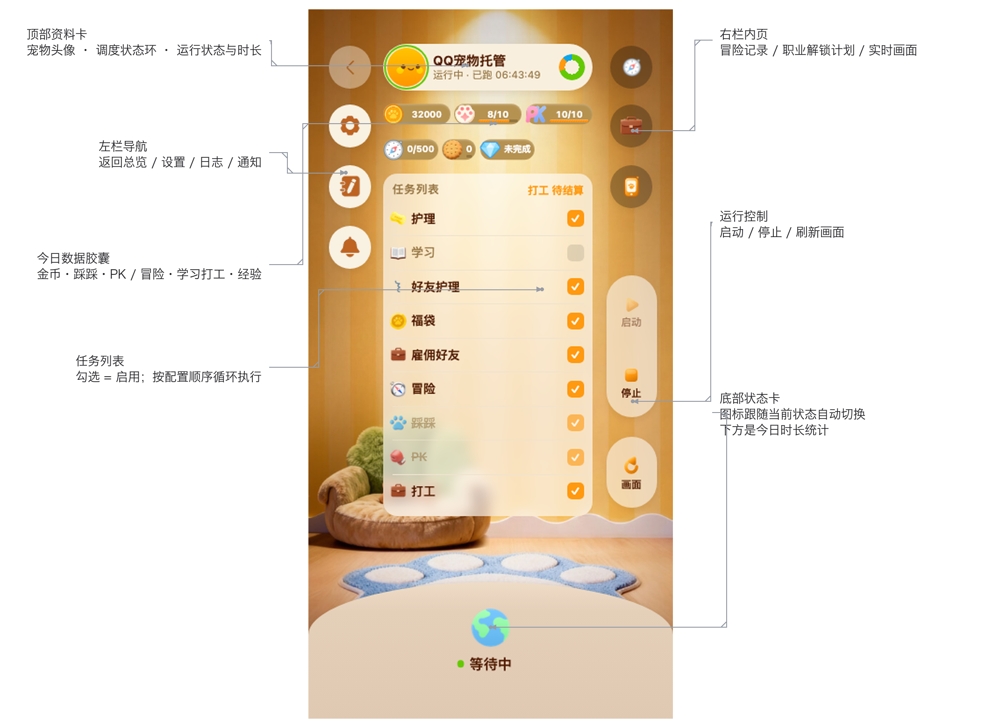

# QQ 宠物自动化助手 · macOS 版

用 macOS 挂着 Android 手机，让 QQ 宠物自己上课、打工、冒险、被好友雇佣。
**手机浏览器打开就能看、能改、能接手操作**——不用装 GUI，也不用守在电脑前。

> 本仓库是 [490720818/qq-pet-copilot](https://github.com/490720818/qq-pet-copilot)（GPL-3.0）的
> **macOS 适配版**：上游面向 Windows（PyQt6 桌面 GUI + scrcpy 窗口嵌入），本版改成
> **命令行调度器 + 手机浏览器仪表盘**，在 macOS 上源码直跑。技术定位不做展开，
> 与上游的差异清单见 [MAC-PORT.md](MAC-PORT.md)。



## 它能做什么

- **学习 / 打工**：自动进学园选课上课、去小镇打工，按你设定的时长目标推进，到量自动停（转冒险）。
- **冒险**：到点连跑，遇到"天色不对"自动召回，收益曲线在仪表盘上能看。
- **好友互动**：踩踩、PK、去指定好友家护理、雇佣好友打工；PK 支持只打比自己低的、指定打手名单。
- **被雇佣召回**：定时代你出门看有没有被雇佣，按策略召回（或故意不召回，把收益让给雇主）。
- **照顾宠物**：体力/清洁低于阈值自动喂食、洗澡；也支持一键护理。
- **福袋**：自动逛好友家领系绳福袋。
- **出问题自己救**：页面错乱先回主页重进，仍失败就重启游戏/重启模拟器再回宠物页；
  连续失败发通知（macOS 桌面通知 + Bark/飞书/Telegram 等）并附手机截图。

任务顺序、开关、时间窗、每日次数都在仪表盘上改，**保存即生效**，不用重启。

## 快速开始

需要 **Python 3.13** 和一台 **Android 真机**（USB 调试打开、QQ 已登录宠物、充电时不熄屏）。

```bash
# 0) 一次性的设备设置：插着电不熄屏
adb shell settings put global stay_on_while_plugged_in 7

# 1) 装依赖
python3 -m venv .venv
.venv/bin/pip install -r requirements.txt

# 2) 配置
cp config.example.yaml config.yaml
#   至少要改这两个：
#   adb.path          = adb 的绝对路径（留空会自动探测）
#   adb.device_serial = 你的设备序列号（adb devices 查看）
#   真机设了锁屏密码的话，recover.method 用「重启游戏」，别用「重启设备」

# 3) 起服务
./run.sh          # 调度器（Ctrl+C 停止；后台常驻见下）
./dashboard.sh    # 手机仪表盘（默认 8787，后台常驻）
```

然后在同一个 Wi-Fi 下，手机浏览器打开 **`http://<Mac 的局域网 IP>:8787`**，
可以「添加到主屏幕」当 App 用。

想后台常驻（关掉终端也不停）：`nohup ./run.sh > /dev/null 2>&1 &`，
或直接在仪表盘上点「启动」。

## 手机仪表盘

纯标准库零依赖，端口 8787、绑定 `0.0.0.0`（仅内网）。日志 3 秒、数据 6 秒自动刷新。

面板分七页：**总览 / 冒险 / 职业 / 日志（实时日志·收益记录）/ 通知 / 设置 / 实时画面**。

| 位置 | 元素 | 作用 |
| --- | --- | --- |
| 顶部 | 宠物资料卡 + 状态环 | 环色 = 调度器状态；点环展开体力/清洁/心情三行 |
| 顶部 | 今日数据胶囊 | 金币 / 踩踩 / PK / 冒险 / 学习打工时长 / 经验日常，带进度条的有每日上限 |
| 中部 | **任务列表** | 分两组：**日常轮巡**（护理·好友护理·福袋，顺序固定）与**任务顺序**（其余，**按住拖动排序**）；勾选框即启用，顺序保存后下一轮调度生效 |
| 右栏 | 冒险 / 职业 / 实时画面 | 收益曲线、职业解锁计划、手机实时画面 |
| 右栏 | 启动 / 停止 | 启停调度器（停止会等当前任务收尾） |
| 底部 | 状态图标 + 今日统计 | 图标跟着"正在做的事"换；下面是今日时长与效率档 |

底部状态图标全部取自游戏内素材，跟官方一致：上课=书本铅笔、打工=爪印金币、
冒险=指南针、护理=香皂、踩踩=爪印、PK=PK 字样、等待中=地球。

> 手动选择房间背景后，会暂停"按当前任务自动换背景"；点一下左上角的衣服圆钮可以
> 按任务跟回，长按则切下一张。

## 实时画面与接管

「实时画面」页把手机屏幕**直播**到浏览器（走设备端 scrcpy-server + 本机 ffmpeg 转 HLS，
免 root），延迟约 1~3 秒，桌面端和 iPhone 都能播。

想自己动手时点 **「接管操作」**：

- 调度器会在下一个安全点**原地让路**（不退出进程、不丢进度），交还后从原处继续，
  实测 3 秒内让路；
- 之后你在网页上点/滑屏幕就是操作手机本体，可以手动收个尾、看看某个界面；
- 点「交还控制」恢复自动，或者 5 分钟不续期自动恢复（防止网页崩了把调度器永久挂住）。

直播是**按需启动**的：没人看就自动回收，挂机期间零开销。

## 推荐配置

在仪表盘的「设置 → 调度」里按玩法调。常见几种：

| 玩法 | 建议 |
| --- | --- |
| 战力型 | 学习拉满（每天 19 小时左右），剩下优先把冒险次数跑够；有条件用小号给大号持续护理 |
| 均衡型 | 学习 15 小时 / 冒险若干 / 留几小时被小号雇佣 |
| 职业型 | 优先打工攒工分升职业，职业卡住再去学习 |
| 勋章型 | 没有通用配置，按勋章要求来 |

## 两个容易踩的游戏机制

**护理勋章不能一键。** 一键护理不计入勋章进度。要拿勋章，必须把护理方式改成
**「ocr检测」**（手动喂食/洗澡）：`care.method` 和 `friend_care.method`。

**收益有疲劳档。** 学习+打工合计超过 8 小时后收益降到 25%，超过 12 小时降到 10%。
仪表盘的「合计满则停止」就是干这个的：到点自动停掉学习/打工、转去冒险
（实测疲劳档下冒险收益不受影响）。设置页只给一个输入框，想"学满 8h 继续打工到 12h"
这类玩法可以手改 `config.yaml` 里的 `schedule.daily_hour_limit` / `work_stop_hours`。

## 常用配置

改 `config.yaml` 或在仪表盘设置页改（推荐后者，保存即生效）。

| 配置 | 说明 |
| --- | --- |
| `adb.path` / `adb.device_serial` | adb 路径 / 设备序列号（设置页下拉带机型标注，离线模拟器也会列出） |
| `control.method` | 控制方案：`injectInputEvent`（真机默认）/ `minitouch`（模拟器更快） |
| `school.attribute` / `school.times_per_day` | 学哪门课 / 每天学习上限（0 不限） |
| `work.location` / `work.duration` | 打工地点（8 个可选）/ 时长（10 分钟 / 45 分钟 / 2 小时） |
| `schedule.coin_threshold` | 金币够就优先学习，不够先打工 |
| `schedule.*_hours` | 时长上限与停止点（见上「疲劳档」） |
| `adventure.*` | 每天冒险次数 / 开始时间 / 单轮连跑次数 / 遇到坏天气是否召回 |
| `care.*` / `friend_care.*` | 护理阈值、护理方式、好友护理对象与间隔 |
| `hire_friend.*` / `employed.*` | 雇佣好友、被雇佣检查的时间段与召回策略 |
| `tasks.failure_interval` | 所有任务统一的失败重试间隔 |
| `recover.method` | 异常恢复方式：`重启游戏` / `重启设备`（真机有锁屏密码时用前者） |
| `notify.*` | 告警渠道（macOS 通知 + Bark/PushPlus/ServerChan/飞书/Telegram/SMTP/webhook） |

## 自检与排查

```bash
./run.sh --test coins               # 只测主页金币识别
./run.sh --test care.read_status    # 只测体力/清洁识别
./run.sh --test work.select_place   # 只跑某个阶段
```

游戏更新后如果某个按钮点不到了，通常是界面文案变了（比如冒险的「开始」改成「出发」）。
用 `./run.sh --test <模块>` 单测逐屏校准 `src/locators.py` 即可，不需要重新做模板。

## 与上游的关系

调度器、各场景实现、UI 定位注册表、OCR 封装等核心能力来自
[上游项目](https://github.com/490720818/qq-pet-copilot)。本版在其基础上做了 macOS 运行链路、
手机仪表盘、实时画面与接管、以及一批适配新版 QQ 界面的修复，差异清单见 [MAC-PORT.md](MAC-PORT.md)。
上游的 PyQt6 桌面 GUI 与 Windows 打包链路在本版**不维护**，需要的话看上游 README。

## 致谢

[qq-pet-copilot](https://github.com/490720818/qq-pet-copilot)（上游）、
[scrcpy](https://github.com/Genymobile/scrcpy)（画面采集）、
[uiautomator2](https://github.com/openatx/uiautomator2)（控件与点击）、
[RapidOCR](https://github.com/RapidAI/RapidOCR) / [PP-OCRv6](https://github.com/PaddlePaddle/PaddleOCR)（文字识别）、
[minitouch](https://github.com/DeviceFarmer/minitouch)（触摸注入）、
[PyQt-Fluent-Widgets](https://github.com/zhiyiYo/PyQt-Fluent-Widgets)（上游 GUI）、
[qqpet-module-opener](https://github.com/yikehuang/qqpet-module-opener)（模拟器打开宠物页的思路）。

## 免责声明

本项目仅供学习研究自动化与 OCR 技术使用。自动化操作可能违反游戏服务条款，
由此产生的一切后果由使用者自行承担。

## 许可证

GNU General Public License v3.0 (GPLv3)，详见 [LICENSE](LICENSE)。
